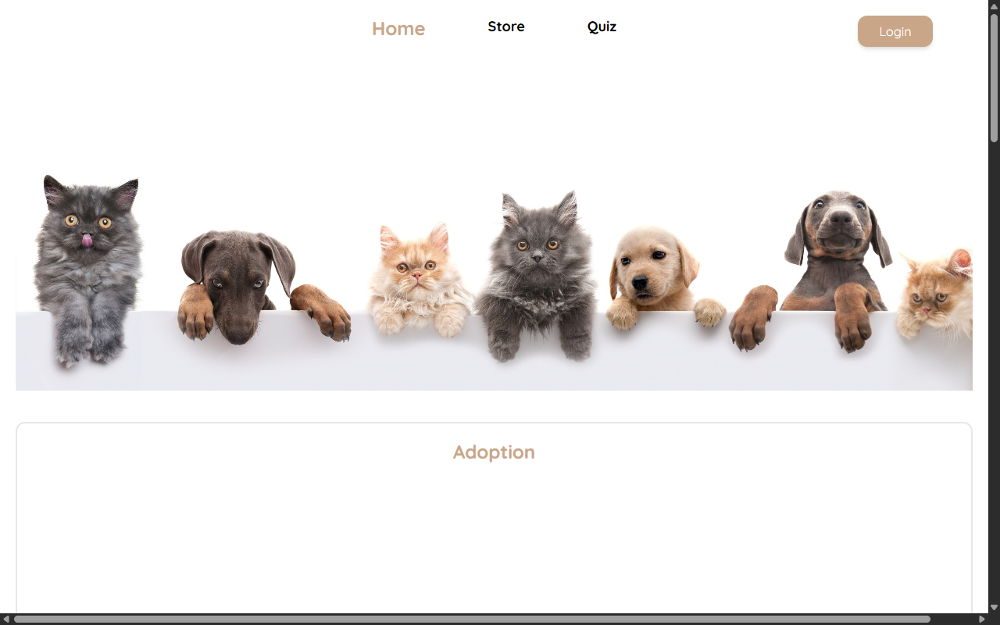
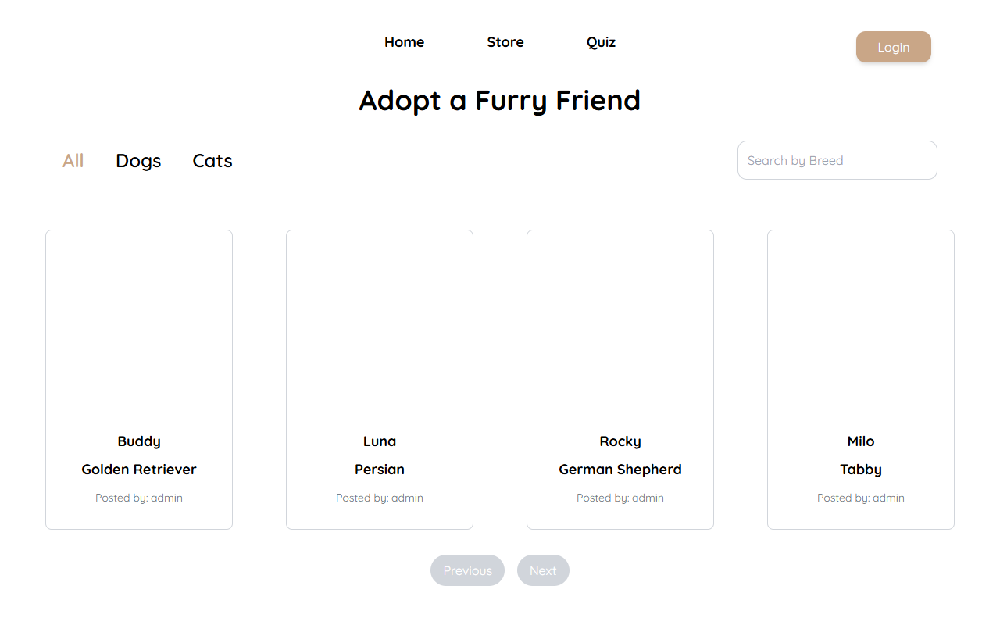
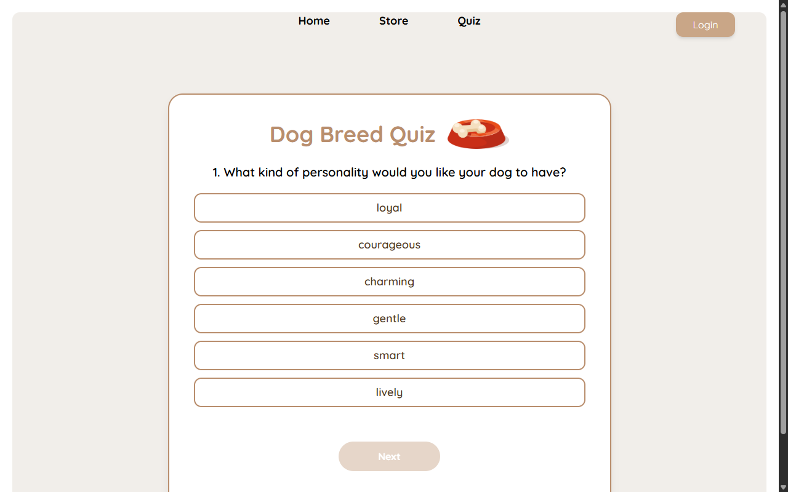
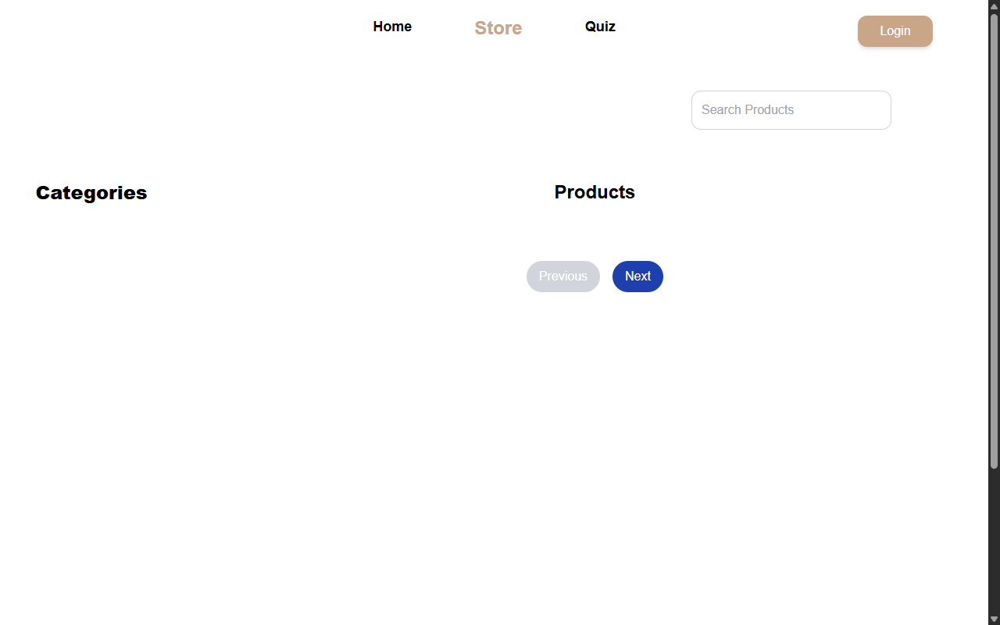
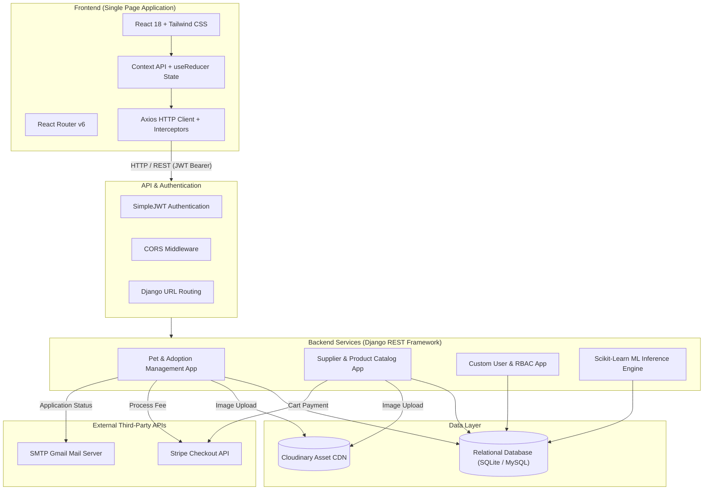
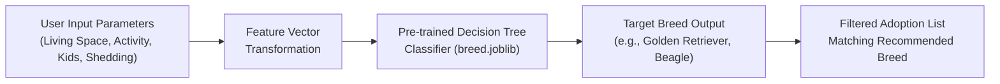
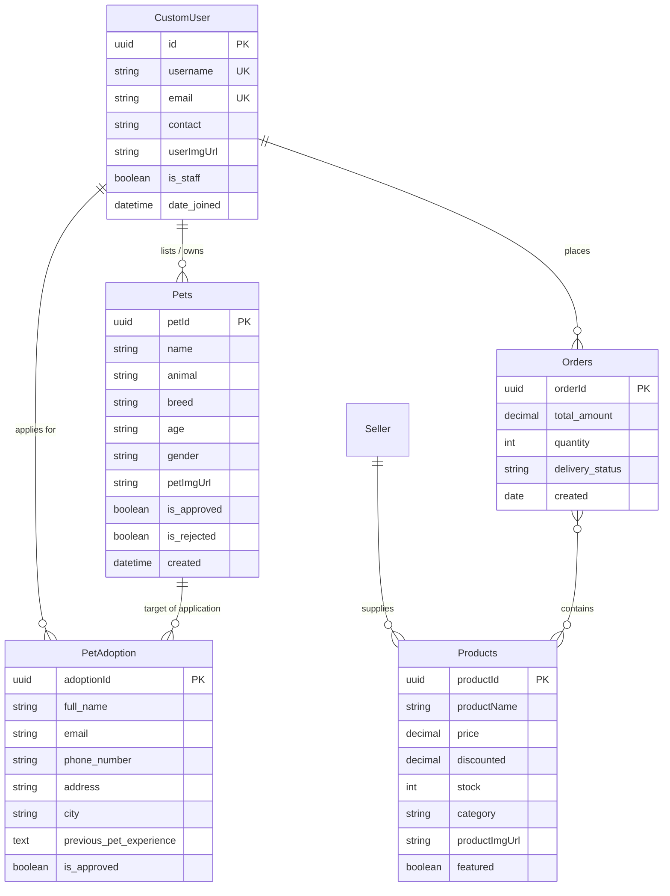

<div align="center">

# 🐾 Pawdoption
### Full-Stack Pet Adoption, Care Management & ML Recommendation Platform

[](https://www.python.org/)
[](https://www.djangoproject.com/)
[](https://reactjs.org/)
[](https://vitejs.dev/)
[](https://tailwindcss.com/)
[](https://scikit-learn.org/)
[](https://stripe.com/)
[](https://cloudinary.com/)

<p align="center">
  <b>A comprehensive engineering platform designed to streamline ethical pet adoption, empower verified animal shelters, and match prospective owners with ideal breeds using predictive Machine Learning.</b>
</p>

*Developed as a Computer Engineering Minor Project at Sagarmatha Engineering College (Affiliated with Tribhuvan University).*

---

</div>

## 📌 Table of Contents
- [User Interface Preview](#-user-interface-preview)
- [Executive Overview](#-executive-overview)
- [System Architecture](#-system-architecture)
- [Key Engineering Modules](#-key-engineering-modules)
- [Machine Learning Recommendation Engine](#-machine-learning-recommendation-engine)
- [RESTful API Specifications](#-restful-api-specifications)
- [Database Schema & Data Models](#-database-schema--data-models)
- [Engineering Team & Roles](#-engineering-team--roles)
- [Getting Started & Local Deployment](#-getting-started--local-deployment)
- [Security & Environment Standards](#-security--environment-standards)

---

## 📸 User Interface Preview

<div align="center">

### 🏠 Landing Page & Hero Section


<br/>

| 🐶 Pet Adoption Directory | 🧠 Machine Learning Breed Quiz |
| :---: | :---: |
|  |  |

| 🛍️ Pet Supplies & Care Store | 📊 Supervised Decision Tree Model |
| :---: | :---: |
|  |  |

</div>

---

## 📖 Executive Overview

Pet adoption workflows traditionally suffer from fragmented vetting processes, lack of standardized pet background information, and frequent post-adoption surrenders caused by lifestyle-breed incompatibility. 

**Pawdoption** addresses these challenges through a unified full-stack ecosystem:
1. **Adoption Pipeline**: Multi-stage application review workflow with digital vetting, verification, and automated confirmation.
2. **Machine Learning Matcher**: Interactive questionnaire that calculates lifestyle vectors (living area, exercise schedule, noise tolerance) to predict the most compatible dog breed.
3. **E-Commerce & Supply Logistics**: Integrated pet marketplace for essential pet supplies with cart reducer state management and Stripe checkout sessions.
4. **Cloud Infrastructure**: Scalable image delivery via Cloudinary CDN and role-based authentication using JSON Web Tokens (JWT).

---

## 🏛️ System Architecture



---

## ⚙️ Key Engineering Modules

### 1. Pet Adoption Workflow
- **Detailed Profiles**: Stores health statuses, vaccination histories, age, breed, and medical descriptions.
- **Application Submission**: Captures prospective owner housing type, previous experience, and contact data.
- **Admin Vetting**: Complete review dashboard allowing administrators to inspect, approve, or reject applicants with automated notification dispatch.

### 2. E-Commerce & Pet Care Shop
- **Catalog Management**: Supports category filtering, stock monitoring, discount calculations, and featured spotlight items.
- **Client-Side Cart Management**: Persistent cart state utilizing `useReducer` and local storage synchronization.
- **Checkout Sessions**: End-to-end payment integration using the official Stripe API with dynamic session URLs.

### 3. Role-Based Access Control (RBAC)
- **Custom User Model**: UUID-primary key user entity extending Django's `AbstractUser`.
- **JWT Authentication**: Token pair generation (`access` + `refresh`) with sliding token expiration windows.
- **Permissions**: Granular route guards separating public visitors, authenticated adopters, verified sellers, and super administrators.

---

## 🧠 Machine Learning Recommendation Engine

To prevent adoption abandonment, Pawdoption includes a supervised Machine Learning model that predicts the most suitable dog breed for an adopter's lifestyle.



- **Algorithm**: Decision Tree Classifier trained on curated canine behavioural and environmental adaptability metrics.
- **Inference Pipeline**: Serialized via `joblib` and evaluated dynamically inside Django view controllers with graceful fallback handling.
- **Dataset**: `MLquiz/pet.csv` compiled and engineered with feature scaling for real-time inference.

---

## 🔌 RESTful API Specifications

| Method | Endpoint | Description | Auth Required |
| :--- | :--- | :--- | :--- |
| `POST` | `/api/token/` | Obtain JWT access and refresh token pair | Public |
| `POST` | `/api/token/refresh/` | Refresh expired access token | Public |
| `GET` | `/api/get-pets/` | Retrieve all approved pets available for adoption | Public |
| `GET` | `/api/get-pets/<uuid:id>/` | Retrieve complete details for a specific pet | Public |
| `POST` | `/api/AdoptionCheckout/` | Initialize Stripe checkout session for adoption fee | Public / Adopter |
| `POST` | `/api/petadoption-form/` | Submit an official pet adoption application | `Bearer Token` |
| `GET` | `/api/products/` | Retrieve active pet supply products and accessories | Public |
| `POST` | `/api/create-checkout-session/`| Process cart checkout with Stripe payment | `Bearer Token` |
| `GET` | `/api/user-profile/` | Fetch current user credentials and order history | `Bearer Token` |

---

## 🗄️ Database Schema & Data Models



---

## 👥 Engineering Team & Roles

This project was engineered as a collaborative minor project by students of **Sagarmatha Engineering College**, Department of Computer Engineering:

| Engineer | Role | Primary Responsibilities |
| :--- | :--- | :--- |
| **Banish Neupane** | **Backend Architecture & Payment Lead** | • Designed system architecture, database schema, and model migrations.<br>• Engineered Stripe payment gateways for adoption & cart checkout.<br>• Implemented RESTful APIs for pet submissions, applications, and JWT auth.<br>• Developed fallback handling and production deployment scripts. |
| **Anish Maharjan** | **Frontend UI & Interactive Systems** | • Architected React component hierarchy, state stores, and Vite build pipeline.<br>• Integrated Tailwind CSS design system and responsive navigation.<br>• Built interactive Machine Learning quiz interface and client state management. |
| **Anurag Jaiswal** | **Backend Models & Order Workflows** | • Designed database entities for seller catalogs, inventory, and order logs.<br>• Implemented seller dashboard endpoints and sales reporting logic.<br>• Conducted database normalization and initial migration scaffolding. |
| **Astha Bajracharya** | **Machine Learning & Data Engineering** | • Curated and preprocessed pet behavioural dataset (`pet.csv`).<br>• Trained, evaluated, and serialized Decision Tree classifier (`breed.joblib`).<br>• Formulated lifestyle question feature matrix and prediction accuracy metrics. |

---

## 🚀 Getting Started & Local Deployment

### Prerequisites
- **Python**: `3.11` or `3.12`
- **Node.js**: `v18.x` or higher (`npm` included)
- **Git**

### 1. Clone the Repository
```bash
git clone https://github.com/banishneupane2002/Pawdoption.git
cd Pawdoption
```

### 2. Backend Setup
```bash
# Create and activate virtual environment
python -m venv venv
source venv/Scripts/activate     # On Windows Git Bash
# .\venv\Scripts\activate        # On Windows PowerShell

# Install dependencies
pip install django djangorestframework djangorestframework-simplejwt django-cors-headers pillow whitenoise python-dotenv cloudinary stripe scikit-learn pandas numpy joblib

# Run database migrations
python manage.py migrate

# Start the Django development server
python manage.py runserver 8000
```
*Backend API will run at `http://127.0.0.1:8000/`.*

### 3. Frontend Setup
In a new terminal window:
```bash
cd pawdoption-main

# Install dependencies
npm install

# Start Vite development server
npm run dev
```
*Frontend application will run at `http://localhost:5173/`.*

---

## 🔒 Security & Environment Standards

- **Secret Keys**: Sensitive credentials (`STRIPE_SECRET_KEY`, `CLOUDINARY_API_SECRET`, database passwords) are encapsulated inside `.env` and strictly ignored via `.gitignore` to prevent secret leaks.
- **Graceful Dev Mode**: If third-party API credentials are not provided during local testing, the platform automatically utilizes safe fallback mechanisms (simulated checkout, local SQLite persistence) ensuring 100% operational uptime.

---

## 📜 Academic Attribution
Developed for the **Bachelor of Computer Engineering (BCT)** curriculum under the guidance of the faculty at **Sagarmatha Engineering College (Tribhuvan University)**.
